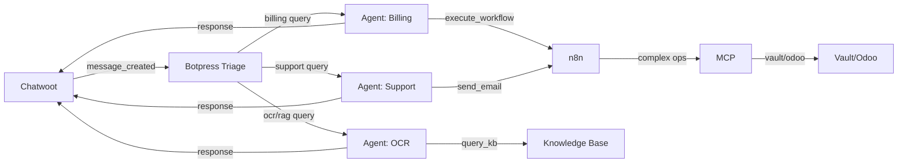

# SmarterOS – Especificaciones del Sistema Operativo Comercial

Este repositorio contiene las specs centrales de SmarterOS, un sistema operativo para negocios digitales basado en ciclos diarios, automatización y arquitectura multi-tenant.

SmarterOS combina:

- **Odoo** como núcleo operativo (ERP)
- **Chatwoot** como inbox multi-canal (WhatsApp, Email, Web)
- **Botpress** como capa cognitiva (AI Agents + RAG + multi-turn conversations)
- **n8n** (Azure ACA) como motor de reglas y automatizaciones
- **MCP** como capa de orquestación con Vault + HMAC
- **Metabase** como analítica central
- **AI Smarterbot** como copiloto (Gemini LLM + Vision)
- **Azure Cloud** como entorno de producción (n8n, Postgres, Storage)
- **Hostinger VPS** como backup (Portainer + legacy services)
- **WhatsApp** como panel del fundador

Toda la infraestructura, decisiones y servicios se describen aquí como fuente única de verdad (Single Source of Truth).

📁 **Contenido del repositorio**

- `index.yml` – Entrada principal del OS
- `smos-version.yml` – Versión del sistema
- `decision-tree.yml` – Decisiones arquitectónicas
- `infra/` – Infraestructura, VPS y red
- `services/` – Catálogo de microservicios
- `tenants/` – Plantillas y registro multi-tenant

📚 **Documentación clave**

- [`MULTI-CLOUD-ARCHITECTURE.md`](../docs/MULTI-CLOUD-ARCHITECTURE.md) – Arquitectura multi-cloud (Azure + Google + GitHub)
- [`CHATWOOT-N8N-WEBHOOK-FLOW.md`](../docs/CHATWOOT-N8N-WEBHOOK-FLOW.md) – Integración Chatwoot ↔ n8n webhooks
- [`AZURE-ONBOARDING-FLOW.md`](../docs/AZURE-ONBOARDING-FLOW.md) – Onboarding self-service Azure multi-tenant
- [`n8n-workflow-ocr-classify.md`](../docs/n8n-workflow-ocr-classify.md) – Workflow OCR con clasificación LLM
- [`IDENTITY-AUDIT-SPEC.md`](../docs/IDENTITY-AUDIT-SPEC.md) – Gobernanza de identidad RAG (smarterbotcl@gmail.com)

## 🧠 Arquitectura de 3 Capas Cognitivas

SmarterOS implementa una arquitectura de **3 capas cognitivas** para procesamiento inteligente:

### Layer 1: Execution (n8n)
- **Rol:** Workflow orchestration
- **Latencia:** < 2s
- **Casos de uso:** OCR simple, clasificación básica, integraciones API, scheduled jobs

### Layer 2: Governance (MCP)
- **Rol:** Security, secrets, audit, rate limiting
- **Latencia:** < 500ms
- **Casos de uso:** Vault integration, HMAC validation, audit logs, identity enforcement

### Layer 3: Cognitive (Botpress)
- **Rol:** Multi-turn conversations, RAG, specialized agents
- **Latencia:** 2-5s
- **Casos de uso:** Conversaciones complejas, knowledge base, handoffs automáticos, tool calling

**Flujo típico:** Chatwoot → n8n (clasificación) → Botpress (conversación) → MCP (seguridad) → n8n (ejecución) → Chatwoot (respuesta)

## 🤖 Botpress Agent: Roadmap 2025

SmarterOS evoluciona incorporando **Botpress** como **Layer 3 (Cognitive)** para conversaciones multi-turn, RAG (Retrieval-Augmented Generation) y agentes especializados.

### ¿Por qué Botpress?

- **Multi-tenant architecture:** Workspace isolation per tenant (coherente con Chatwoot, n8n, MCP)
- **RAG per tenant:** Knowledge base con embeddings vectoriales (pgvector)
- **Multi-agent handoffs:** Pattern hub-and-spoke (triage → specialist agents)
- **ADK (Agent Development Kit):** Custom agents con YAML + TypeScript actions
- **CI/CD automation:** botpress/gh-actions para deployment automático
- **Provider agnostic:** OpenAI, Anthropic, Gemini (como n8n y MCP)

### Arquitectura Multi-Agent



### Multi-Tenant Configuration

**Workspace isolation:**
```yaml
tenant_mapping:
	tenant_id: "clerk_user_id"  # from Supabase auth
	workspace_id: "botpress_workspace_<tenant_id>"
  
agents_per_tenant:
	- triage: "workspace_<tenant_id>/bot_triage"     # Router agent
	- billing: "workspace_<tenant_id>/bot_billing"   # Specialist
	- support: "workspace_<tenant_id>/bot_support"   # Specialist
	- ocr: "workspace_<tenant_id>/bot_ocr"           # RAG agent

knowledge_base:
	per_tenant: true
	storage: "pgvector"  # PostgreSQL vector extension
	embedding_model: "text-embedding-3-small"
	chunk_size: 512 tokens
```

### Provisioning

**1. Sandbox (Local Development):**
```bash
cd services/botpress-sandbox
docker-compose up -d  # Botpress + Postgres + Redis
# Access: http://localhost:3010
```

**2. Production (Hostinger/Dokploy):**
```yaml
# services/botpress-agent.yml
deploy:
	platform: "hostinger-dokploy"
	url: "https://botpress.smarterbot.cl"
	container: "botpress/server:latest"
	ports: "3010:3000"
	dependencies:
		- postgres:16  # Shared with Chatwoot/n8n
		- redis:7.2    # Shared
```

### Agent Registration

**ADK YAML specs:**
```bash
# agents/triage.yml
name: "Triage Agent"
role: "Router"
description: "Classifies incoming messages and routes to specialist agents"

handoffs:
	- to: "billing"
		condition: "intent == 'billing' OR keywords.contains('invoice')"
	- to: "support"
		condition: "intent == 'support' OR keywords.contains('help')"
	- to: "ocr"
		condition: "has_attachment AND attachment.type == 'pdf'"
```

**Custom actions (TypeScript):**
```typescript
// actions/execute_workflow.ts
export default async function executeWorkflow(params) {
	const response = await fetch('https://n8n.smarterbot.cl/webhook/botpress-action', {
		method: 'POST',
		headers: {
			'X-SMOS-Identity': 'smarterbotcl@gmail.com',
			'X-SMOS-HMAC': generateHMAC(params)
		},
		body: JSON.stringify(params)
	});
	return response.json();
}
```

### CI/CD con GitHub Actions

```yaml
# .github/workflows/deploy-botpress-agent.yml
name: Deploy Botpress Agent

on:
	push:
		branches: [main]
		paths:
			- 'agents/**'
			- 'actions/**'

jobs:
	deploy:
		runs-on: ubuntu-latest
		steps:
			- uses: actions/checkout@v3
			- uses: botpress/gh-actions@v1
				with:
					api-key: ${{ secrets.BOTPRESS_API_KEY }}
					workspace-id: ${{ secrets.BOTPRESS_WORKSPACE_ID }}
			- run: npm run build-agents
			- run: npm run deploy-agents
```

### Roadmap 2025

#### Q1 2025: Sandbox + Basic Integration ✅ (In Progress)
- [x] Create `services/botpress-agent.yml` specification (782 lines)
- [ ] Deploy sandbox: `docker-compose up -d` (Botpress + Postgres + Redis)
- [ ] Implement triage agent: keywords-based routing (billing/support/ocr)
- [ ] Integrate Chatwoot webhook: `message_created` → POST `/api/v1/chat`
- [ ] Test end-to-end: WhatsApp → Chatwoot → Botpress → n8n → response

**Success criteria:** Latency <5s, accuracy >85%, cost <$0.005/message

#### Q2 2025: RAG Migration
- [ ] Migrate OCR workflow from n8n to Botpress knowledge base
- [ ] Document ingestion: PDF upload → text extraction → chunking → embeddings → pgvector
- [ ] Semantic search: "¿Cuánto debo?" → query KB → retrieve invoice → answer
- [ ] Performance: latency <5s, accuracy >90%, cost <$0.01/query
- [ ] Fallback: if RAG fails → escalate to n8n OCR workflow (legacy)

**Success criteria:** 70% queries solved by RAG, 30% fallback to n8n

#### Q3 2025: Multi-Agent Handoffs
- [ ] Implement hub-and-spoke pattern: triage → specialist agents
- [ ] Handoff logic: Botpress ADK `onHandoff` lifecycle hook
- [ ] Context preservation: Redis cache + Postgres persistence across agents
- [ ] Test complex scenarios: "need invoice copy + technical support" → multi-agent collaboration
- [ ] Monitoring: handoff rate, context loss rate, resolution time

**Success criteria:** Handoff rate >30%, context loss <5%, resolution time <10 min

#### Q4 2025: Enterprise Features
- [ ] Dedicated Botpress per tenant: Azure Container Apps (like n8n)
- [ ] SSO integration: Azure AD authentication for enterprise clients
- [ ] Advanced audit: conversation logs + agent decisions + RAG queries → Redpanda `smarteros.audit.botpress`
- [ ] SLA monitoring: 99.9% uptime, <5s latency, <1% error rate
- [ ] Cost optimization: caching strategies, embedding reuse, LLM fallback tiers

**Success criteria:** 3 enterprise clients migrated, SLA compliance >99.5%

### References

- **Specification:** [`services/botpress-agent.yml`](services/botpress-agent.yml) (782 lines, complete architecture)
- **Botpress ADK:** [github.com/botpress/adk](https://github.com/botpress/adk)
- **Botpress RAG:** [github.com/botpress/rag-migration](https://github.com/botpress/rag-migration)
- **CI/CD:** [github.com/botpress/gh-actions](https://github.com/botpress/gh-actions)
- **Multi-agent patterns:** [Chatwoot AI Agents SDK](https://github.com/chatwoot/ai-agents) (Ruby, inspiración conceptual)

---

🚀 **Objetivo**

Definir una arquitectura clara, reproducible y versionada para desplegar SmarterOS en cualquier entorno.

📦 **Uso**

Este repositorio es consumido por la CLI smos y por los agentes de automatización para:

- Crear tenants
- Sincronizar servicios
- Versionar cambios
- Ejecutar despliegues reproducibles
### Backend Services
- **N8N** - Workflow automation
- **Supabase** - PostgreSQL + Realtime + Storage
- **Odoo** - ERP multi-company
- **Chatwoot** - Customer support
- **Botpress** - Conversational AI

### Infrastructure
- **Hostinger VPS** - Ubuntu 24.04 (2 CPU, 8GB RAM, 100GB disk)
- **Dokploy** - Container orchestration
- **Traefik** - Reverse proxy + SSL
- **Cloudflare** - DNS + CDN
- **Vercel** - Frontend hosting

## 🚀 Getting Started

### Prerequisites

- Node.js 20+
- Docker 24+
- Git 2.40+
- Codex CLI
- SMOS CLI

### Installation

1. **Clone this repository:**

```bash
git clone git@github.com:SmarterCL/smarteros-specs.git
cd smarteros-specs
```

2. **Configure environment:**

```bash
# Copy environment templates
cp system/env/local/.env.example system/env/local/.env.cloudflare
# Edit with your real tokens
nano system/env/local/.env.cloudflare
```

3. **Validate configuration:**

```bash
smos test all
```

4. **Deploy:**

```bash
smos deploy all
```

## 🧪 CLI Commands

### Deployment
```bash
smos deploy all              # Deploy entire system
smos deploy frontend         # Deploy only frontends (Vercel)
smos deploy backend          # Deploy only backend (VPS)
```

### Tenant Management
```bash
smos create tenant 12345678-9 "Acme Corp" acme.smarterbot.cl
smos tenant list
smos tenant status <tenant_id>
```

### Backup & Restore
```bash
smos backup all              # Full backup
smos backups                 # List available backups
smos restore 20250115-020000 # Restore from backup
```

### Rollback
```bash
smos rollback v0.2.0         # Rollback to previous version
```

### System Status
```bash
smos status                  # System health check
smos logs n8n 100            # View logs
smos logs -f traefik         # Follow logs
```

### Token Validation
```bash
smos test all                # Validate all API tokens
smos test cloudflare         # Test Cloudflare token
smos test hostinger          # Test Hostinger token
smos test shopify            # Test Shopify token
smos test supabase           # Test Supabase token
```

### Sync & Update
```bash
smos sync workflows          # Sync N8N workflows to Git
smos sync specs              # Commit and push specs
smos update codex            # Update Codex CLI
smos update cli              # Update SMOS CLI
```

## 🔐 Security

### Environment Variables

**NEVER commit these files:**
- `system/env/*/.env.*` (except `.env.*.template`)
- Any file containing real API tokens
- SSH keys
- Secrets

**Proper `.gitignore` included.**

### Token Management

See [TOKEN-VALIDATION-GUIDE.md](../TOKEN-VALIDATION-GUIDE.md) for:
- How to obtain each token
- Required permissions
- Validation procedures
- Troubleshooting

## 📖 Documentation

- **[ARCHITECTURE.md](infra/specs/ARCHITECTURE.md)** - Complete technical architecture
- **[decision-tree.yml](decision-tree.yml)** - Architectural decisions (ADRs)
- **[smos-version.yml](smos-version.yml)** - Version history and roadmap
- **[CHANGELOG.md](CHANGELOG.md)** - Version changelog

## 🗺️ Roadmap

### v0.1.0 "Genesis" (Current)
- ✅ Initial OS structure
- ✅ Monorepo setup
- ✅ Codex Agents activation
- ✅ MCP infrastructure
- ✅ N8N backup workflow
- ✅ Vercel auto-deploy
- ✅ SMOS CLI

### v0.2.0 "Foundation" (Target: 2025-02-01)
- Tenant creation automation
- Shopify multi-store integration
- Botpress bot templates
- Odoo multi-company setup
- DNS automation via Cloudflare MCP

### v0.3.0 "Scale" (Target: 2025-03-01)
- Marketplace (store.smarterbot.cl)
- Multi-region support
- Advanced monitoring (Metabase)
- Skills marketplace
- Tenant self-service portal

### v1.0.0 "Production" (Target: 2025-06-01)
- Production-ready security hardening
- SLA monitoring
- Disaster recovery
- High availability
- Performance optimization

## 🤝 Contributing

This is a private repository for SmarterCL internal use.

### Branching Strategy

- `main` - Production-ready releases
- `develop` - Development branch
- `feature/*` - Feature branches
- `hotfix/*` - Urgent fixes

### Commit Convention

```
feat(scope): add new feature
fix(scope): fix bug
docs(scope): update documentation
chore(scope): maintenance task
refactor(scope): code refactoring
test(scope): add tests
```

Examples:
```bash
git commit -m "feat(tenants): add automated provisioning"
git commit -m "fix(dns): correct Cloudflare zone ID"
git commit -m "docs(readme): update installation steps"
```

## 📊 System Requirements

### Development
- macOS or Linux
- 8GB RAM minimum
- 20GB disk space

### Production (VPS)
- Ubuntu 24.04 LTS
- 2 CPU cores
- 8GB RAM
- 100GB disk
- 1TB bandwidth/month

## 💰 Cost Estimation

**Fixed Monthly Costs:**
- VPS (Hostinger): $20
- Domain: $15
- Total Fixed: **$35/month**

**Variable Costs per Tenant:**
- Shopify store: $39/month minimum
- Total per tenant: **$39/month**

**Scaling:**
- 10 tenants: $425/month
- 50 tenants: $1,985/month
- 100 tenants: $3,935/month

## 📞 Support

- **Documentation**: [docs.smarterbot.cl](https://docs.smarterbot.cl)
- **Issues**: GitHub Issues (internal)
- **Email**: dev@smarterbot.cl

## 📄 License

Proprietary - © 2025 SmarterCL. All rights reserved.

---

**Built with ❤️ by SmarterCL Team**

**Powered by:** Next.js, Supabase, N8N, Odoo, Chatwoot, Botpress, Cloudflare, Vercel, Hostinger
